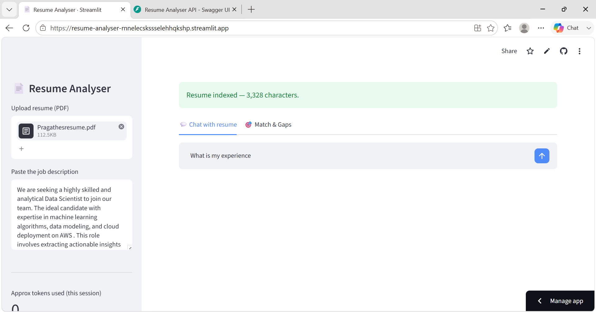
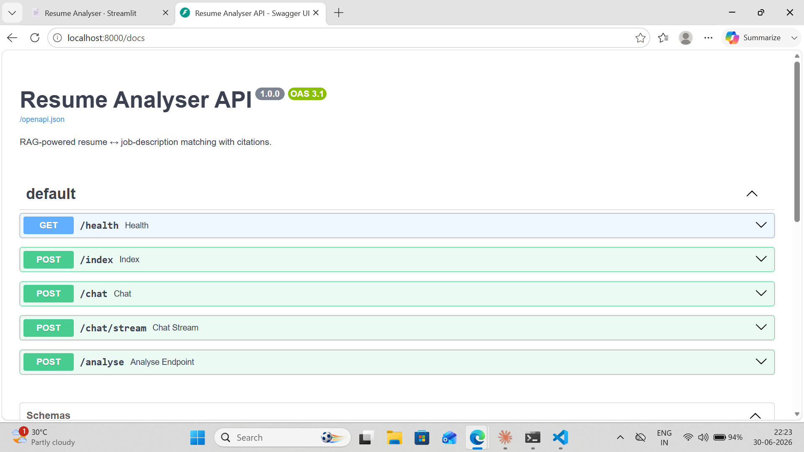

# Resume Analyser — RAG-powered Resume ↔ Job Match


Upload a resume and a job description; get a match score, a gap analysis,
and a chat assistant that answers about the resume — with citations to the
exact resume lines, so nothing is hallucinated.

## Live demo

**▶️ Live app:** https://resume-analyser-rnnelecskssselehhqkshp.streamlit.app/
(free-tier hosting — if it shows "app went to sleep," click "Yes, get this app
back up," it wakes in under a minute)

The FastAPI backend (with interactive OpenAPI docs at `/docs`) runs locally — see
[Run the API](#run-the-api-fastapi).

## Screenshots

| Streamlit UI | FastAPI docs (Swagger) |
|:---:|:---:|
|  |  |

## What it does

- **Match score** — how well the resume fits the job description (0–100).
- **Gap analysis** — skills/keywords in the JD missing from the resume.
- **Chat with your resume** — ask questions, get grounded answers.
- **Citations / grounding** — every answer and score shows the exact
  resume excerpts it used.

## Tech

RAG · sentence-transformers embeddings (`all-MiniLM-L6-v2`) · FAISS vector DB
· Google Gemini · **FastAPI** (REST + streaming) · Streamlit · Docker · pytest

## Architecture

```
              ┌─────────────┐        ┌──────────────┐
  Streamlit ──┤             │        │   src/ core  │
   UI (app.py)│  shared     │        │  pdf_loader  │
              │  business   ├───────►│  chunker     │
  FastAPI ────┤  logic      │        │  embeddings  │
  (api.py)    │  (src/)     │        │  vector_store│
              └─────────────┘        │  rag         │
                                     │  analyser    │
                                     │  llm         │
                                     └──────────────┘
```

Both the Streamlit UI and the FastAPI service call the **same** `src/` core,
so logic is written once and consumed by either a human (UI) or a machine (API).

## How it works

1. PDF text is extracted (`pdfplumber`), chunked, and embedded **locally**
   with sentence-transformers — no API cost.
2. Chunks are stored in an in-memory **FAISS** vector index.
3. A question or the job description retrieves the top-k relevant chunks (**RAG**).
4. **Gemini** answers using *only* the retrieved chunks and cites them, so
   answers are grounded in the actual resume.

## Run locally

1. `python -m venv venv` and activate it
   (`.\venv\Scripts\Activate.ps1` on Windows, `source venv/bin/activate` on macOS/Linux).
2. `pip install -r requirements.txt`
3. Copy `.env.example` to `.env` and add your `GEMINI_API_KEY`
   (free key: https://aistudio.google.com/app/apikey).
4. `streamlit run app.py`

## Run the API (FastAPI)

```
uvicorn api:app --reload
```

Then open interactive docs at http://localhost:8000/docs. Example flow:

```bash
# 1. Upload a resume -> get a doc_id
curl -F "file=@resume.pdf" http://localhost:8000/index

# 2. Ask a grounded question
curl -X POST http://localhost:8000/chat \
  -H "Content-Type: application/json" \
  -d '{"doc_id":"<id>","question":"What are the Python skills?"}'

# 3. Stream the answer token-by-token (SSE)
curl -N -X POST http://localhost:8000/chat/stream \
  -H "Content-Type: application/json" \
  -d '{"doc_id":"<id>","question":"Summarise the experience"}'

# 4. Score against a job description
curl -X POST http://localhost:8000/analyse \
  -H "Content-Type: application/json" \
  -d '{"doc_id":"<id>","job_description":"..."}'
```

Every request is logged as structured JSON (method, path, status, latency).

## Evaluation

A RAG eval harness measures retrieval quality and answer correctness on a
golden dataset (`eval/eval_dataset.json`):

```
python eval/run_eval.py --retrieval-only   # retrieval hit-rate, no API key
python eval/run_eval.py                     # + LLM-as-judge answer accuracy
```

## Tests

```
pytest
```

Covers chunking, vector-store retrieval, and API routing/validation/error
handling (no API key needed).

## Docker

```
docker build -t resume-analyser .
docker run -p 8000:8000 -e GEMINI_API_KEY=your_key resume-analyser
```

## Deploy (Streamlit Community Cloud)

1. Push this repo to GitHub.
2. On https://share.streamlit.io, create an app from the repo, main file `app.py`.
3. In the app's **Secrets**, add:
   ```
   GEMINI_API_KEY = "your_key_here"
   ```
   Never commit the real key — `.env` is git-ignored.

## Cost

Runs entirely on free-tier infrastructure: local embeddings + a free-tier
LLM, with response caching to avoid repeat calls. Realistic cost: **$0**.

## Configuration

- `GEMINI_API_KEY` — required for chat and analysis.
- `GEMINI_MODEL` — optional, defaults to `gemini-2.5-flash` (free tier,
  ~5 requests/min). The client retries 429 rate-limit errors with
  exponential backoff and surfaces a friendly message if the quota is hit.
